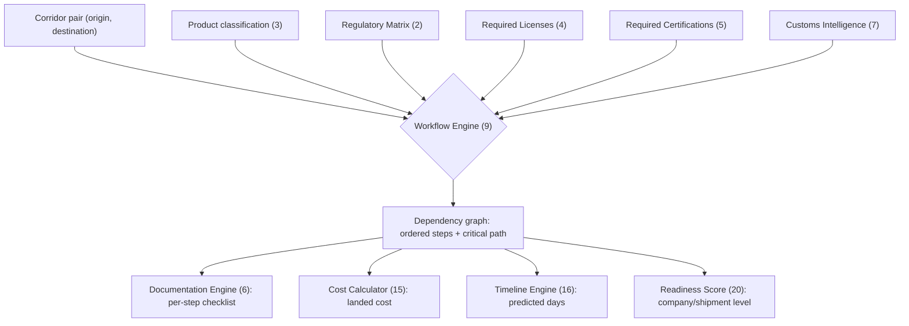

# Harbourview Market Entry OS — North Star

**Version 1.3** · 2026-07-18 · supersedes v1.2

Status key: ✅ Built · 🟡 Partial · ⬜ Not Started · ⚠️ Open Decision (not a build item — needs a call)

---

## Executive Summary

This is a build-status audit of the Market Entry OS concept — turning Harbourview's existing intelligence into a one-click, per-corridor execution plan — scored against what's actually shipped today. Of the 20 layers, the intelligence-gathering side (Corridor Intelligence, Regulatory Matrix, Market Intelligence, Live Intelligence) is furthest along, because it rides on dossier and crawler infrastructure already in production. The execution side (Workflow Engine, Documentation Engine, Cost Calculator, Timeline Engine) — the layers that would actually make this "one-click" instead of "one more report" — hasn't been started.

Four decisions block that execution work and should be resolved before any new schema is written: how much counterparty detail the public DTO can show (conflicts with the shipped HAR-99/101 decision), what the business model actually is, whether a low readiness score just prints a to-do list or triggers a warm intro from the network, and which of two unreconciled knowledge graph implementations is system-of-record (see the v1.3 reconciliation below). Recommended path: lock those four decisions, then build one corridor (Canada → Germany) end-to-end starting with the Workflow Engine, before generalizing.

---

## The 20 Layers

| # | Layer | Status | Notes |
|---|-------|--------|-------|
| 1 | Corridor Intelligence | 🟡 | Country intel records (14 populated) and source registry exist. Not structured as corridor *pairs* (origin→destination) with legality/history/risk/difficulty scoring. |
| 2 | Regulatory Matrix | 🟡 | Covered in dossier prose (Denmark, France, Germany, Ghana, Isle of Man). Not a structured, queryable matrix per corridor/product. |
| 3 | Product Classification Engine | ⬜ | No schema differentiating flower/extract/oil/API/genetics requirements. |
| 4 | Required Licenses | 🟡 | Embedded in dossier text. Not structured or linked to workflow steps. |
| 5 | Required Certifications | 🟡 | Same — exists as prose (EU GMP, GACP mentioned in dossiers), not structured. |
| 6 | Documentation Engine | ⬜ | No per-shipment document checklist generator. |
| 7 | Customs Intelligence | ⬜ | No HS codes, tariffs, or clearance-time data modeled. |
| 8 | Regulatory Authority Database | 🟡 | Authorities named in dossiers, no structured contacts/portals/processing-time db. |
| 9 | Workflow Engine | ⬜ | No dependency-graph execution plan generator. This is the core "one-click" mechanic and doesn't exist yet. |
| 10 | Company Intelligence | 🟡 | Marketplace has listings/companies, but importer/broker/lab/freight types aren't modeled distinctly. **Conflicts with CounterpartyStub — see below.** |
| 11 | Commercial Intelligence (buyers) | 🟡 | Marketplace inquiries and deal rooms exist. Buyer-side data (hospitals, tenders, pharmacies) is thin. |
| 12 | Market Intelligence | 🟡 | 16 market metrics seeded, country intel populated. Reasonably strong relative to other layers. |
| 13 | Competitor Intelligence | ⬜ | No competitor volume/facility/partner tracking. |
| 14 | Risk Engine | 🟡 | Maturity Score™ implicitly captures some risk dimension; no dedicated political/currency/supply-chain risk model. |
| 15 | Cost Calculator | ⬜ | No landed-cost estimation logic. |
| 16 | Timeline Engine | ⬜ | No critical-path/bottleneck estimator. |
| 17 | Templates | 🟡 | Dossier template v5 and Strangford doc kit exist. Trade-specific agreements (Quality, GDP SOPs, CAPA) not built. |
| 18 | Live Intelligence | 🟡 | Strongest infrastructure piece — crawler across 1,000+ sources, cadence bug fixed (PR #934). Not yet surfaced as a "what changed" feed tied to active corridor plans. |
| 19 | AI Corridor Advisor | 🟡 | Anthropic gateway wired, match rationale + digest narrative generation exist. The specific corridor Q&A UX in the doc's example isn't built. |
| 20 | Readiness Score | 🟡 | Maturity Score™ /25 exists at country level. Doc wants it at company/shipment level — different unit of analysis. |

**Read on this table:** almost nothing is a clean ✅. The intelligence-gathering layers (1, 2, 12, 18) are furthest along because they're extensions of what the dossier and crawler systems already do. The execution layers (6, 9, 15, 16) — the ones that actually make this "one-click" instead of "one more report" — are all ⬜. That's the real gap between what exists and what the doc describes.

---

## Reconciliation with the 2026-07-18 AI Market Entry Engine Handoff

A newer solution-architecture handoff doc — "Harbourview Platform – AI Market Entry Engine," received as a pasted brief for an external SA quote on 2026-07-18, not itself a file checked into this repo — describes the same "press one button, enter a market" concept as this North Star, but breaks out four things the 20-layer table above doesn't track as separate build items: a named multi-agent architecture, an explicit knowledge graph, a continuous data-ingestion platform, and a specific tech stack. Reconciled against current codebase state as inspected on 2026-07-18 (a snapshot, not a re-verified live check at read time):

| New-doc concept | Status | Evidence |
|---|---|---|
| Multi-agent architecture (30 named agents: Regulatory, Trade, Pricing, ...) | 🟡 Scaffolding only | `supabase/migrations/20260531000000_intelligence_automation_tables.sql` (the GitHub #458 build, closed 2026-05-29) created `ia_agent_tasks` (work queue), `ia_graph_entities`, `ia_graph_edges`, `ia_evidence_vault`, `ia_counterparties`, `ia_scoring_records`, with a full admin UI at `app/admin/(protected)/intelligence-automation/*`. No code inserts into these tables via an LLM or autonomous agent — `agent_label`/`suggested_action` are free-text fields filled through human admin actions (`AgentTaskActions.tsx`). This is a human-operated work-queue UI with the right shape, not the multi-agent orchestration the new doc describes. |
| Knowledge graph | ⚠️ Two competing implementations, neither canonical | `supabase/migrations/20260607140000_cannabis_data_contract_v1_p0_p1.sql` builds a real 23-table typed graph (`cannabis_intelligence` schema — jurisdictions, licence_types, entity_licences, evidence_claims, contradictions, etc.), seeded for 5 jurisdictions in `20260708000000_ci_graph_foundation.sql`. Separately, `lib/intelligence/workflowEngine.ts` (added 2026-07-13) is built on `jurisdiction_playbooks` instead, with a header comment calling `cannabis_intelligence` "the abandoned ... schema, which was never populated with real schema." That claim looks at least partly stale — it was seeded three days before the comment was written — but a repo-wide search found no importers of `workflowEngine.ts` anywhere in the app as of this snapshot: an unwired prototype pointed at a second, competing graph. This is a decision for Tyler, not one to infer from code comments alone. |
| Data ingestion platform | 🟡 Real pipeline, currently degraded | Two-track pipeline: `lib/scrapers/` (311 commercial sources, zero regulatory) and the intelligence estate (`source-engine-fetch` → `hv-extract` → `hv-score` → `hv-pipeline-orchestrator` edge functions → `signals`/`ia_signals` via `hv_ingest_snapshot_to_staging`/`promote_snapshot_to_signals`, both confirmed live). Per `docs/INTELLIGENCE_ARCHITECTURE_SPEC.md` (verified 2026-07-14), the scoring stage is documented as inverted (SEO spam scores 99, clean headlines score under 40) with "no correct promotion path" currently. No translation stage, no LLM-based quality classification (spec proposes `hv-classify`, unbuilt). This is an open defect layered on a partial pipeline, not just a gap — compounded by a separately-flagged `hv-score` Anthropic billing failure (credit balance too low) that would block the scoring stage entirely even once fixed. |
| Hybrid search (SQL + full-text + vector + AI retrieval) | 🟡 Vector search exists, not hybrid | pgvector confirmed (`ia_signal_embeddings`, 768-dim HNSW, `public.ia_search_signals()`), covering signal-level semantic search only. No combined SQL+FTS+vector+AI-reranking layer, and `cannabis_intelligence` has no embedding columns at all — the two knowledge graph candidates and the search layer aren't unified. |
| Mission Workspace (submit market + product + business profile → live interactive workspace) | ⬜ Not started | No file or route matches this concept. `app/intake/` is lead capture (`IntakeForm.tsx`), not a generated workspace. `app/intelligence/` is static per-country/module dossier content. Consistent with the existing table's Layer 6 (Documentation Engine) and Layer 9 (Workflow Engine), both already ⬜. |
| Durable workflow orchestration (Temporal or equivalent) | ⬜ Not started | `package.json` as inspected has no Temporal, BullMQ, or Inngest dependency. Scheduling is Vercel Cron + `pg_cron` + manual sequential edge-function chaining (`hv-pipeline-orchestrator`) — no dependency graph, retries, or durable execution. This is the concrete infra gap behind Layer 9's ⬜, not just missing schema. |
| Recommended tech stack | Mostly aligned, some gaps | Live: Next.js 16.2.10 (App Router — newer than the doc's "Next.js 15" assumption), React 19.2.7, TypeScript, Tailwind 4, TanStack Query, React Three Fiber, Supabase, `@anthropic-ai/sdk`, `@google/genai`, Upstash Redis. Absent: shadcn/ui (no `components.json` or scaffold beyond the raw `class-variance-authority` dep), AG Grid, React Flow, MapLibre GL, Motion/Framer Motion, Kafka, NATS, Temporal. Redis is present but for rate-limiting, not job orchestration. |
| 5-phase roadmap (Phase 1 core/KG foundation → Phase 5 predictive analytics) | Not scoped anywhere | `docs/FEATURES_ROADMAP.md` has no mission-engine or workflow-automation phase. `docs/INTELLIGENCE_ARCHITECTURE_SPEC.md` is itself a target/proposal document for the ingestion rebuild described above, not shipped work. No roadmap doc scopes predictive analytics or market simulation. |

**Net read:** the new handoff's ambition sits ahead of the 20-layer table above in two ways worth calling out as decisions rather than folding silently into the build queue. First, it names multi-agent orchestration as its own architecture, where today's build is a human-operated queue with the right schema but no agents actually running against it. Second, it treats "knowledge graph" as one settled concept, where the codebase currently has two unreconciled implementations — and the newer one was built to explicitly route around the older one on a claim ("never populated") that doesn't fully hold up against the migration history. Both belong next to the other open decisions below, not resolved by whichever engineer touches the code next.

---

## What the Original Doc Is Missing

### Trust & governance
| Item | Status | Notes |
|---|---|---|
| Confidence/freshness scoring per datapoint | ⬜ | Layer 19's example answers "yes" to a controlled-substance question with no hedge or as-of date. Needed before any corridor plan is user-facing. |
| Connect Layer 18 to existing crawler | 🟡 | Infrastructure exists; not wired to corridor plans as a live input. |
| CounterpartyStub conflict | ⚠️ | Layers 10/11 want rich company/buyer detail per corridor. Shipped decision (HAR-99/101) keeps counterparties out of the public DTO. Needs an explicit disclosure-tier decision, not a default assumption. |
| Extend signal→evidence→review→approve→dossier→publish governance to corridor plans | 🟡 | Pipeline exists for dossiers. Doc doesn't say whether corridor plans run through it or are a second, ungoverned path. |

### Content gaps
| Item | Status | Notes |
|---|---|---|
| Gray-area / unclear-answer handling | ⬜ | Every example in the doc is clean-legal. No defined output for "unclear," "contested," or "no." |
| Multi-hop / re-export corridors | ⬜ | Model is single origin→destination. Real trade often routes through a processing/re-export hub. |
| Feedback loop on estimates | ⬜ | Nothing validates a predicted 83-day timeline or approval probability against what actually happened. |

### Bigger picture
| Item | Status | Notes |
|---|---|---|
| Business model | ⚠️ | Zero mention of monetization (subscription / per-report / take-rate / lead-gen). Reclassified from ⬜ — this is a decision, not a build item, and it should decide build order, not follow it. |
| Network integration | ⚠️ | Undecided whether a low readiness score just outputs a to-do list, or triggers an actual intro from the 6,000-contact network. Different product, different moat. |
| Horizontal expansion (pharma, psychedelics, biologics) | ⚠️ | Explicitly flagged in the doc's closing section. Worth deciding on purpose — this dilutes cannabis-specific depth if done by drift instead of decision. |

---

## Value Framework (illustrative — needs real pilot data)

No corridor has run through this system end-to-end yet, so this is a structure to populate from the Canada → Germany pilot, not a measured result.

| Value driver | What it replaces | How to measure |
|---|---|---|
| Research time | Manual regulatory/license/customs lookup per corridor — the same work that produced the Denmark, France, and Germany dossiers by hand | Analyst-hours per corridor, before vs. after Workflow Engine |
| Time-to-market | The doc's own example cites an 83-day predicted approval timeline with no validation loop (see Content gaps, above) | Predicted vs. actual days, once Timeline Engine (16) has real cases to check against |
| Compliance risk avoided | Missed license/certification steps caught late in the process | Count of corridor plans that surface a blocking requirement before shipment vs. after |
| Deal velocity | Marketplace inquiries that stall on missing buyer-side or counterparty context | Time from inquiry to deal-room open, before vs. after Company/Commercial Intelligence layers mature |

Once the pilot corridor runs, replace this table with real before/after numbers — that's the metric to put in front of investors, not a modeled estimate.

### Layer 9 (Workflow Engine) — how it fits together

---

## Recommended Build Order

1. **Resolve all four open decisions before any schema work** — they change what Layers 9/10/11/20 are even allowed to build:
   - **CounterpartyStub disclosure tier** — Layers 10/11 want rich company/buyer detail per corridor; HAR-99/101 shipped keeping counterparties out of the public DTO. Needs an explicit tier decision.
   - **Business model / monetization** — subscription, per-report, take-rate, or lead-gen changes what the Readiness Score and Workflow Engine outputs need to look like.
   - **Network integration** — whether a low readiness score prints a to-do list or triggers a warm intro from the 6,000-contact network. Different product, different moat.
   - **Knowledge graph canonicalization** — `cannabis_intelligence` (23-table typed graph, partially seeded) vs `jurisdiction_playbooks` (what `lib/intelligence/workflowEngine.ts` actually reads) are two unreconciled implementations of the same concept. Pick one as system-of-record before more Layer 9 work lands on top of either.
2. **Pick one corridor** (Canada → Germany — Germany already has the deepest dossier) and build the full stack end-to-end for it before generalizing.
3. **Workflow Engine (9)** first among the ⬜ layers — it's the mechanic that makes everything else feel like "one-click" instead of a report.
4. **Documentation Engine (6)** next — checklist generation is a bounded, high-value slice.
5. **Cost Calculator (15)** and **Timeline Engine (16)** last among near-term work — they depend on data the workflow engine will surface anyway.

---

## Change Log

- **v1.3** (2026-07-18): Reconciled a newer, more detailed "AI Market Entry Engine" solution-architecture handoff doc against current codebase state (multi-agent architecture, knowledge graph, data-ingestion platform, hybrid search, Mission Workspace, durable workflow orchestration, tech stack, 5-phase roadmap). Surfaced a new open decision — two unreconciled knowledge graph implementations (`cannabis_intelligence` vs `jurisdiction_playbooks`) — and added it to the build-order blockers, taking the count from three to four. No new build items were scheduled silently; multi-agent orchestration and knowledge graph unification are logged as decisions, consistent with how Business Model and Network Integration were already handled in v1.1.
- **v1.2** (2026-07-11): Fact-checked the closing note against live GitHub state — the four sprint PRs are resolved, not open. Replaced with current status.
- **v1.1** (2026-07-10): Added executive summary. Added Value Framework section with Layer 9 workflow diagram. Reclassified Business Model from ⬜ to ⚠️ (it's a decision, not a build item). Reordered Recommended Build Order to resolve the three open decisions before any corridor/schema work.
- **v1.0** (2026-07-10): Initial 20-layer audit.

---

*Status check (2026-07-11): the four sprint PRs referenced in earlier drafts are resolved — **#921**, **#934**, and **#985** merged; **#962** was closed unmerged after a `package-lock.json` conflict but its work landed on `main` via a manual rebase (commit `8c3a620`, confirmed as an ancestor of `main`). They're no longer a blocker for Market Entry OS work. Five PRs are open as of this check — **#1021** (marketplace ratings forward-fix), **#1022** (compliance-brief rate limiting), **#1023** (heatmap preferences guard), **#1026** (migration drift reconciliation), and this doc's own **#1024** — separate, newer items worth a status pass on their own terms. Track 3 Airtable contract (HAR-52) wasn't reverified in this pass.*
